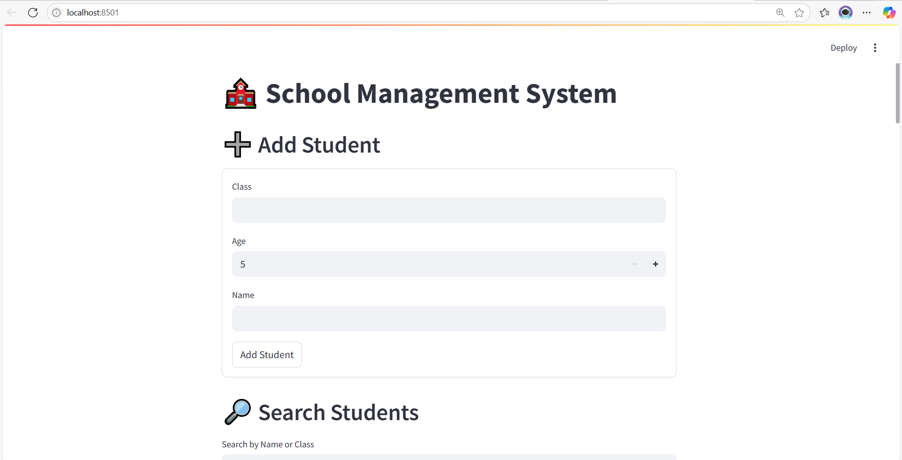
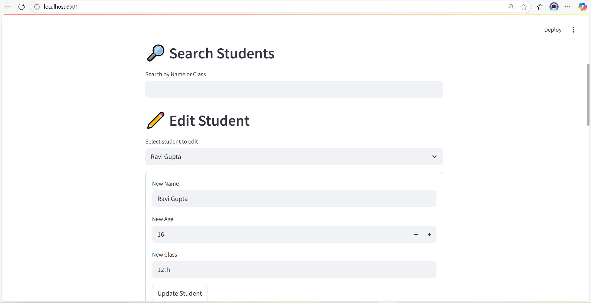
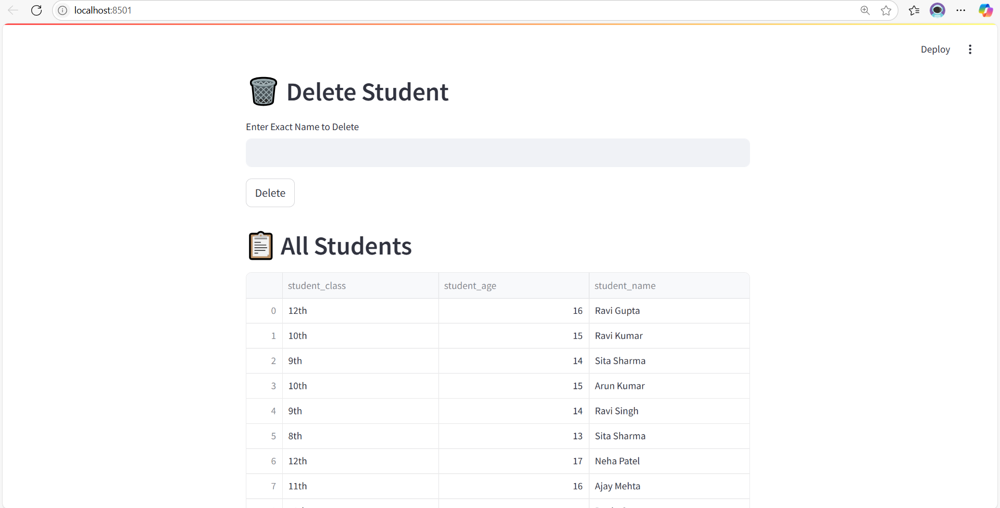

# SCHOOL_MANAGEMENT

A simple and interactive **School Management System** built with **Streamlit** and **Pandas**.  
This app allows users to **add, edit, delete, search, and export student records**, and visualize data like student distribution and average age per class.

---

## 🔧 Features

- ➕ Add New Students
- 🔍 Search Students by Name or Class
- ✏️ Edit Existing Student Info
- 🗑️ Delete Students by Name
- 📋 View All Students in a Table
- 📊 Visualize Number of Students per Class
- 📈 Visualize Average Age per Class
- 📤 Export Student Data to Excel

---

## 📁 Project Structure
SCHOOL_MANAGEMENT/
│
├── dashboard/streamlit.py # Main Streamlit app
├── students.csv # Local data storage
└── README.md #
└── screenshots/ # Folder containing UI screenshots
## 📸 Screenshots

### ➕ Add Student

### 🔍 Search Students  

### ✏️ Edit Student  

### 🗑️ Delete Student  

### 📋 All Students Table

### 📊 Visualizations

